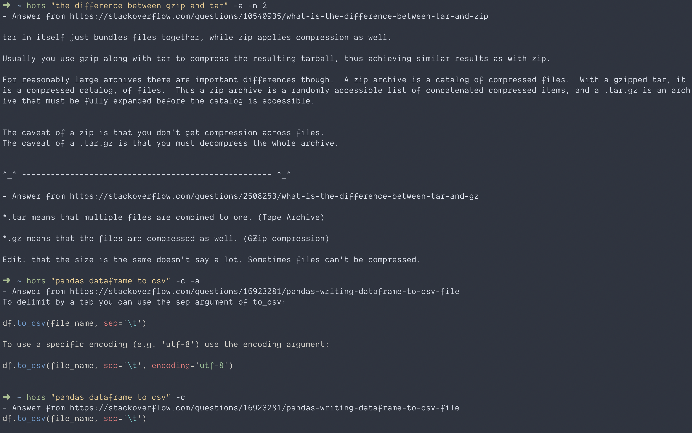

[](https://dev.azure.com/WindSoilder/hors/_build/latest?definitionId=1&branchName=master)
[](https://crates.io/crates/hors)
[](https://ci.appveyor.com/project/WindSoilder/hors)


# [hors](https://crates.io/crates/hors)
Awesome program [howdoi](https://github.com/gleitz/howdoi) which implemented in rust, along with easily usage lib.

For binary usage, please go through the rest of this file.  For lib documentation, please check [here](https://docs.rs/hors/latest/hors/).

# Screenshot


# Installation
hors is written in `Rust`.  The recommended way to install `hors` is through `cargo`.
```shell
cargo install hors
```

## Note
For compiling with current version, you'll need the dependencies for  [bindgen](https://rust-lang.github.io/rust-bindgen/requirements.html) available at build time.

For more information, please check out the following [issue](https://github.com/rust-onig/rust-onig/issues/109), sorry for the inconvenience.

# Tested platforms
For now, `hors` has been tested with the following platforms:
- linux
- osx
- windows

# Usage
```shell
USAGE:
    hors [FLAGS] [OPTIONS] <QUERY>

FLAGS:
    -a, --all              display the full text of the answer.
    -c, --color            enable colorized output.
        --disable_proxy    Disable system proxy.
    -h, --help             Prints help information
    -l, --link             display only the answer link.
    -V, --version          Prints version information

OPTIONS:
    -e, --engine <engine>                    select middle search engine, currently support `bing`, `google` and
                                             `duckduckgo`. [default: duckduckgo]
    -n, --number_answers <number_answers>    number of answers to return. [default: 1]

ARGS:
    <QUERY>
```

# Usage example
1.  Want to know how to export pandas dataframe to csv?
```shell
hors "pandas dataframe to csv"
```

Here it is:

```
- Answer from https://stackoverflow.com/questions/16923281/pandas-writing-dataframe-to-csv-file
df.to_csv(file_name, sep='\t')
```

2. If we just want to know where is the answer existed?
```shell
hors "pandas dataframe to csv" -l
```

Here it is:
```
Title - pandas writing dataframe to csv file
https://stackoverflow.com/questions/16923281/pandas-writing-dataframe-to-csv-file
```

3. If we want more about the answer detailed?
```shell
hors "how to parse json in rust" -a
```

Here it is:
```shell
- Answer from https://stackoverflow.com/questions/30292752/how-do-i-parse-a-json-file

Solved by the many helpful members of the Rust community:

extern crate rustc_serialize;
use rustc_serialize::json::Json;
use std::fs::File;
use std::io::Read;

fn main() {
    let mut file = File::open("text.json").unwrap();
    let mut data = String::new();
    file.read_to_string(&mut data).unwrap();

    let json = Json::from_str(&data).unwrap();
    println!("{}", json.find_path(&["Address", "Street"]).unwrap());
}
```

4. What if we want to make output code colorized?
```shell
hors "how to parse json in python" -c
```
Here it is:
```python
import json
j = json.loads('{"one" : "1", "two" : "2", "three" : "3"}')
print j['two']
```

5. How to get more than one answers
```shell
hors "set git remote url" -n 2 -a
```
Here it is:
```
- Answer from https://stackoverflow.com/questions/2432764/how-to-change-the-uri-url-for-a-remote-git-repository
You can

git remote set-url origin new.git.url/here

(see git help remote) or you can just edit .git/config and change the URLs there. You're not in any danger of losing history unless you do something very silly (and if you're worried, just make a copy of your repo, since your repo is your history.)


^_^ ==================================================== ^_^

- Answer from https://stackoverflow.com/questions/42830557/git-remote-add-origin-vs-remote-set-url-origin
below is used to a add a new remote:

git remote add origin git@github.com:User/UserRepo.git

below is used to change the url of an existing remote repository:

git remote set-url origin git@github.com:User/UserRepo.git

below will push your code to the master branch of the remote repository defined with origin and -u let you point your current local branch to the remote master branch:

git push -u origin master

Documentation
```

6. The default search engine is bing, how can I use other search engine?
```shell
hors "set git remote url" -n 2 -a -e "google"
```

# Customize
`hors` is command line tools, which means that users can easily customize it.

For example, in Linux or MacOS, you can easily customize `hors` by alias.  You can add the following lines into `profile`:
```shell
alias hors="hors -c"
```
which will enable `hors` colorize output by default.  Let's says that we want to make `hors` output the whole answers, coloring output by default.  So we can add the following lines into `profile`:
```shell
alias hors="hors -c -a"
```

# Use hors as lib
Hors can be used as a lib, here is an example:

```rust
use std::str::FromStr;
use hors::{self, Config, OutputOption, Result, SearchEngine};

// Get stackoverflow links according to user input query.
let search_engine: SearchEngine = SearchEngine::from_str("bing").unwrap();
let target_links: Vec<String> = hors::search_links(
    "how to parse json in rust",
    search_engine,
).unwrap();
assert_ne!(target_links.len(), 0);
for link in target_links {
    assert!(link.contains("stackoverflow.com"));
}

// Get actual answers according to stackoverflow links.
let conf: Config = Config::new(OutputOption::OnlyCode, 3, false);
let links: Vec<String> = vec![
    String::from("https://stackoverflow.com/questions/7771011/how-to-parse-data-in-json")
];
let answers: String = hors::get_answers(&links, conf).unwrap();
assert!(
    answers.contains(
        r#"j = json.loads('{"one" : "1", "two" : "2", "three" : "3"}')"#
    )
);
```

For more information, please check [documentation](https://docs.rs/hors/latest/hors/)

# Special thanks
Very thanks for the awesome project and links :)
- [howdoi](https://github.com/gleitz/howdoi) inspires `hors` (Fow now `hors` is `howdoi` which implements in `rust`).
- [stackoverflow](https://stackoverflow.com/) helps user solve question about coding.

# About the name
`hors` is the abbreviation of `howdoi in rust`.
